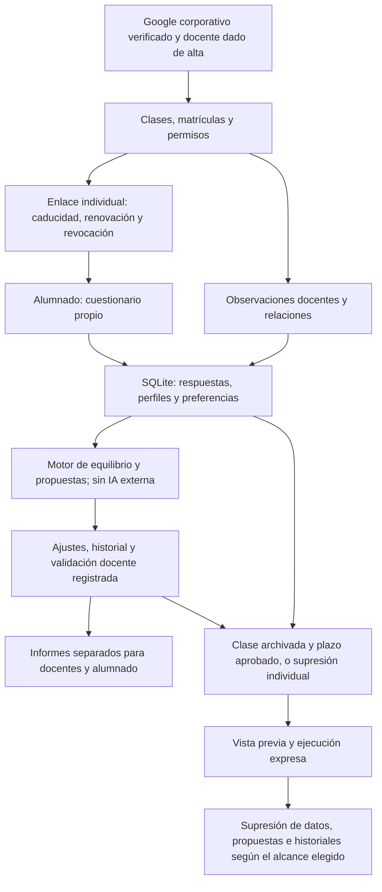

# Equipos equilibrados

Migración de Google Apps Script a **Flask + SQLite** y **Angular 22 + Bootstrap 5 + SCSS**. Interfaz y documentación en castellano. Preparada para servir backend y frontend desde una cuenta gratuita de PythonAnywhere.

Consulta la [guía de privacidad y actualización](manual/08-privacidad-y-actualizacion.md) antes de actualizar: incluye migración, caducidad de enlaces y borrado efectivo.

## Adecuación al RGPD

Documentación revisada el 9 de octubre de 2026 a partir de los diagramas del informe inicial y del código actual. Describe las medidas implementadas; la configuración y autorización de producción deben comprobarse aparte.

La aplicación incorpora identidad Google corporativa verificada y alta docente explícita, permisos por clase y enlaces individuales caducables y revocables. Las propuestas se calculan mediante reglas y búsqueda algorítmica, sin proveedor externo de IA, y requieren validación docente registrada. La supresión de clases archivadas depende del plazo configurado y de una ejecución expresa tras vista previa; existe también un procedimiento individual que alcanza propuestas e historiales afectados. Deben minimizarse perfiles y textos libres y revisarse las copias y exportaciones externas.

Estos controles apoyan la adecuación al RGPD, pero no acreditan por sí solos el cumplimiento ni sustituyen la autorización del centro. Antes del uso con datos reales deben verificarse en el despliegue, completar la información de privacidad, revisar proveedores y condiciones de tratamiento y aprobar la conservación y el borrado, incluidas copias y exportaciones.

La página `/privacidad` muestra `PRIVACY_CONTROLLER`, `PRIVACY_CONTACT`, `PRIVACY_LEGAL_BASIS`, `PRIVACY_RETENTION` y `PRIVACY_PROVIDERS`, configuradas en el `.env` de cada despliegue (`backend/.env` en Generador de equipos). `PRIVACY_RETENTION` es texto informativo y no activa el borrado. Consulta los plazos y comandos operativos en la guía específica.

[Guía de privacidad](manual/08-privacidad-y-actualizacion.md) · [Web](https://formadorequipos.eu.pythonanywhere.com/).

El enlace utiliza el nuevo dominio europeo. La migración está en curso según la información disponible; debe confirmarse su finalización, la versión desplegada y el tratamiento de las copias del alojamiento anterior. Alojar en Europa no determina dónde procesan los datos otros proveedores.

## Flujo de funcionamiento y datos



Los pasos de conservación representan una operación de mantenimiento que debe configurarse y ejecutarse; no un borrado automático por el mero transcurso del plazo.


## Empezar

Consulta [el manual de instalación y despliegue](manual/README.md). Incluye desarrollo local, Google OAuth, PythonAnywhere, copias de seguridad y actualizaciones.

## Estructura

```text
backend/app/       API Flask, acceso Google, SQLite, cuestionario, equipos e informes
backend/tests/     Pruebas de permisos y flujos completos
frontend/src/      Aplicación Angular con Bootstrap y SCSS
frontend/dist/     Resultado de compilación (no versionado)
manual/            Manual de despliegue y mantenimiento
scripts/           Extracción de textos originales y comprobaciones de equivalencia
*.gs               Código original conservado como referencia
```

## Funcionalidad

- Google OpenID Connect con dominio `cuatrovientos.org` y alta docente explícita. Roles administrador/docente y permisos por clase.
- Clases, matrículas, docentes compartidos, observaciones y relaciones entre estudiantes.
- Enlaces individuales copiables y descargables, con renovación y revocación.
- Invitaciones de curso por correo mediante Google Workspace, con vista previa, envío individual o de pendientes, registro y reenvío explícito.
- Cuestionario con confirmación inicial, borradores, guardado automático, envío, interpretación personalizada y reapertura con historial de revisiones.
- Propuestas de equipos de 3 a 5 personas, cinco componentes de equilibrio, restricciones duras y preferencias blandas.
- Alternativas, historial, movimientos e intercambios, bloqueos, regeneración parcial, deshacer, validación y reapertura.
- Descarga de resultados y equipos CSV/JSON, fichas docentes PDF e informes de equipos para docentes y alumnado. El informe del alumnado no incluye observaciones privadas ni penalizaciones docentes.

## Decisiones de migración

- SQLite comienza vacío. No se importan datos ni se conecta con Sheets, Drive o Docs.
- El cuestionario efectivamente definido en `Schema.gs` es `V3_REDUCIDA`: 32 preguntas y ocho dimensiones funcionales. Los archivos recibidos mencionan una versión de nueve dimensiones, pero no contienen sus nuevas preguntas ni su migración. No se han inventado preguntas para activar esa versión. La ponderación y la interpretación corresponden al cuestionario disponible.
- Los textos de preguntas y personalización se extraen de los originales a `backend/app/questionnaire.json`. Producción no ejecuta JavaScript en el servidor ni requiere Apps Script.
- El motor conserva las fórmulas y el orden de prioridades. La búsqueda usa el generador aleatorio de Python: las propuestas concretas no serán idénticas a las de JavaScript para una misma semilla. Se ha comprobado la equivalencia de las métricas con datos sintéticos.
- El servicio de tokens se implementa en Python: enlaces derivados con HMAC, hash almacenado, versión y revocación. El token va en el fragmento de la URL y en cabeceras de la API, evitando su inclusión en rutas de peticiones del servidor. Cambiar `SECRET_KEY` invalida sesiones y requiere renovar los enlaces anteriores.
- Los enlaces se pueden copiar, descargar o enviar por correo desde la clase. El envío requiere configurar una cuenta Google Workspace en el servidor; consulta `manual/07-correo.md`.
- Los PDF se generan al descargarlos; se han adaptado al formato de documento descargable. Los informes docentes y de alumnado tienen contenidos separados.

## Verificación

```powershell
.\.venv\Scripts\python.exe -m pytest backend/tests -q
.\.venv\Scripts\python.exe scripts/check_parity.py
cd frontend
npm.cmd ci
npm.cmd run build
```

`check_parity.py` necesita Node y los `.gs` originales, solo para pruebas. `scripts/qa_pdf.py` genera PDF con nombres ficticios en `tmp/pdfs` para revisión visual.

El acceso real de Google y el alojamiento deben verificarse tras configurar las credenciales y la cuenta. No hay credenciales incorporadas ni un acceso docente alternativo que evite Google.
