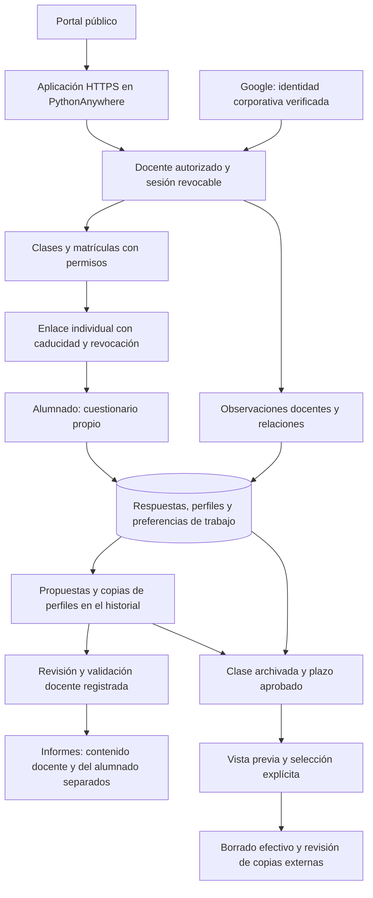

# Privacidad y actualización de Equipos equilibrados

Cambios locales preparados el 7 de octubre de 2026. No se han desplegado en PythonAnywhere ni constituyen una certificación RGPD. Esta guía completa y, cuando hay diferencias, actualiza las instrucciones anteriores.

## Flujo de datos



El cuestionario genera perfiles funcionales mediante reglas y el motor propone equipos. No se han añadido servicios de IA ni cambiado las fórmulas. Las observaciones y relaciones pueden describir a personas identificables; las propuestas guardan copias de los perfiles, y los historiales conservan versiones anteriores. Por ello, el borrado incluye esas copias.

## Cambios

- Las sesiones docentes incluyen una versión comprobada contra la base en cada acceso. Cerrar sesión, editar o desactivar la cuenta invalida las sesiones previas. Reactivar una cuenta no recupera esas sesiones. Google debe verificar correo y dominio corporativo, y su identificador estable queda vinculado a la cuenta autorizada.
- Los enlaces individuales caducan: siete días por defecto, configurables entre uno y noventa. Solicitar el enlace actual no prolonga su vigencia; renovarlo o volver a solicitarlo después de caducar cambia el token e invalida el anterior. La vista previa y el envío de invitaciones rechazan enlaces caducados.
- La aplicación retira el token del fragmento de la barra de direcciones al abrir el cuestionario y lo conserva solo en memoria. **Después de recargar o cerrar la página hay que abrir de nuevo el enlace original**, mientras siga vigente. Las respuestas guardadas continúan en el servidor.
- Se cuentan los accesos con enlaces inválidos por dirección de origen, con un identificador HMAC sin IP ni token en claro. Tras superar cien errores, se bloquea el acceso del origen durante el resto de la ventana fija de quince minutos. Los contadores son compartidos entre procesos y se eliminan al recibir nuevos fallos o con `purge-link-failures`; programar esta limpieza para periodos sin uso. Verificar cómo entrega PythonAnywhere la dirección de origen, especialmente en redes compartidas.
- Cada validación de propuesta guarda persona revisora y fecha. Los informes PDF siguen exigiendo una propuesta validada. El CSV docente permite revisar borradores e indica su estado; no debe distribuirse al alumnado como decisión definitiva.
- Hay un aviso específico de privacidad y recordatorios para no incluir diagnósticos, información clínica ni detalles privados de otras personas. La confirmación inicial acredita lectura; no se presenta como una solución genérica a la base jurídica del tratamiento.
- El logotipo se sirve desde la propia aplicación, usando el recurso local del portal de cuestionarios, para evitar cargarlo desde otro servidor en cada visita.
- Archivar una clase sigue ocultándola y revocando los enlaces. Ahora se explica que no equivale a borrar. Se añaden operaciones de borrado por conservación y de supresión individual.

El enlace individual sigue siendo una credencial de acceso: quien lo reciba puede acceder al cuestionario mientras sea válido. La caducidad reduce ese riesgo, pero no demuestra la identidad del alumno. El centro debe decidir si este mecanismo es adecuado o necesita autenticación individual adicional. Compartir enlaces o descargarlos requiere protección equivalente a otras credenciales.

## Configuración

Completar `backend/.env` a partir del ejemplo sin sobrescribir las variables reales. Las variables ya definidas en el entorno tienen prioridad.

| Variable | Uso |
|---|---|
| `SECRET_KEY` | Clave aleatoria de al menos 32 caracteres; se rechazan ejemplos conocidos. Rotarla invalida sesiones y exige renovar enlaces. |
| `COOKIE_SECURE` | `true` en producción HTTPS. Solo desarrollo local HTTP: `false`. |
| `DATABASE_PATH` | Ruta absoluta de la base existente, fuera del directorio público. |
| `PUBLIC_BASE_URL` | Dirección HTTPS definitiva de la aplicación. |
| `GOOGLE_CLIENT_ID`, `GOOGLE_CLIENT_SECRET`, `TEACHER_DOMAIN` | Identidad corporativa y callback `/auth/callback`, según la configuración aprobada. |
| `STUDENT_LINK_DAYS` | Vigencia de los enlaces: 7 por defecto, entero entre 1 y 90. El cambio se aplica a nuevas emisiones/renovaciones. |
| `RETENTION_DAYS` | Plazo aprobado para clases archivadas. Vacío deshabilita el borrado por plazo. |
| `AUDIT_RETENTION_DAYS` | Plazo independiente para registros de auditoría. Vacío deshabilita su limpieza por plazo. |
| `PRIVACY_CONTROLLER`, `PRIVACY_CONTACT` | Responsable, canal de derechos y contacto del DPD cuando corresponda. |
| `PRIVACY_LEGAL_BASIS` | Base y justificación del uso concreto, valoradas por el centro. |
| `PRIVACY_RETENTION` | Criterios para respuestas, perfiles, observaciones, relaciones, cuentas, informes, registros y copias. |
| `PRIVACY_PROVIDERS` | PythonAnywhere, Google y SMTP según su uso real; ubicación, contratación y transferencias. |

Los campos institucionales vacíos aparecen como pendientes en `/privacidad`. No se han inventado plazos de conservación, base jurídica ni titularidad contractual. Tener una cuenta del alojamiento asociada a Gmail no acredita por sí solo quién es el titular.

## Actualización en PythonAnywhere

1. Mantener una ventana sin escrituras, respaldar base, código y configuración en una ubicación restringida y ensayar con una copia. Conservar una vía de restauración.
2. Instalar `backend/requirements.txt` en el entorno virtual y copiar código y frontend. Para compilar, desde `frontend`: `npm ci` y `npm run build`. El resultado debe estar en `frontend/dist/browser` o en el directorio indicado por `FRONTEND_DIST`.
3. Completar las variables; forzar HTTPS en el alojamiento y mantener debug desactivado. La configuración WSGI existente sigue utilizando la fábrica de la aplicación.
4. Desde `backend` y con el entorno virtual activo, ejecutar `flask --app wsgi upgrade-db`. El comando añade campos de sesión, identidad, caducidad, actividad y revisión, contadores de accesos y disparadores de actividad. Es repetible y conserva cuentas, respuestas y propuestas.
5. **Los enlaces antiguos sin fecha de caducidad quedan revocados** y deben renovarse. Las sesiones antiguas dejan de aceptarse. Las propuestas antiguas validadas sin autor y fecha de revisión vuelven a borrador para una nueva validación; se conserva su contenido.
6. Las clases existentes reciben como punto de partida la fecha de actualización, evitando que entren inmediatamente en una limpieza por antigüedad. Los cambios posteriores de clase, matrículas, respuestas, observaciones, relaciones, propuestas, asignaciones e invitaciones actualizan su actividad.
7. Recargar la aplicación y verificar con personas ficticias: Google, permisos entre clases, cierre y revocación, caducidad y renovación de enlaces, guardado, revisión e informes. El SMTP de las pruebas es simulado: no se han enviado invitaciones reales.

Para una instalación nueva se conserva `init-db` y el alta explícita del administrador. Para actualizar, usar `upgrade-db`, que no vuelve a autorizar cuentas mediante `ADMIN_EMAIL`. Para volver atrás, restaurar código, configuración y base conjuntamente en la ventana de mantenimiento, evitando perder escrituras posteriores.

## Conservación: clases completas

Ejecutar los siguientes comandos desde `backend`, con el entorno virtual activado.

```sh
flask --app wsgi purge-expired
flask --app wsgi purge-expired --class-id ID_REVISADO
# Solo tras revisar candidatos, obligaciones de conservación y posibles reclamaciones:
flask --app wsgi purge-expired --class-id ID_REVISADO --execute
```

Sustituir `ID_REVISADO` por el identificador mostrado en la vista previa. Se puede repetir `--class-id`. Solo se admiten clases archivadas cuya última actividad haya superado el plazo. Una selección inválida rechaza toda la operación. La operación usa una transacción que bloquea escrituras competidoras; programarla en mantenimiento para no interrumpir el trabajo.

Se eliminan matrículas, todas las revisiones de respuestas, perfiles, observaciones, relaciones, propuestas y sus copias, cambios manuales, registros de invitaciones, asociaciones docentes y registros de auditoría vinculados de forma identificable. Se elimina la ficha del alumno si ya no tiene matrículas en otras clases; si sigue matriculado, se conserva. Las cuentas docentes permanecen para gestionar otras clases y conservar autorías justificadas.

Los registros antiguos cuyo identificador es compartido por varias clases pueden permanecer asociados a una persona aún matriculada: deben someterse a la política de auditoría, no interpretarse como una copia de sus respuestas. Para revisar y eliminar registros antiguos de auditoría:

```sh
flask --app wsgi purge-audit
flask --app wsgi purge-audit --execute
```

## Supresión individual

```sh
flask --app wsgi erase-student --student-id ID_ALUMNO
flask --app wsgi erase-student --student-id ID_ALUMNO --execute
```

El identificador se obtiene de la ficha del alumno o mediante consulta administrativa de la base. Revisar primero la vista previa y la procedencia de la solicitud. Esta operación no depende del plazo automático: elimina al alumno en todas sus clases, respuestas, observaciones, relaciones, enlaces e invitaciones. También elimina **las propuestas completas y sus historiales que contengan su identificador**, porque guardan copias de perfiles. Esas propuestas deberán regenerarse y revisarse para el resto del grupo. No elimina las cuentas ni respuestas de los demás alumnos.

La supresión por identificador no permite detectar automáticamente un nombre mencionado por otra persona dentro de un texto libre. Esas referencias deben revisarse manualmente al resolver derechos. El borrado de filas no garantiza sobrescritura física de SQLite ni elimina archivos descargados, correos, registros del alojamiento o copias de seguridad; aplicar la política a esas ubicaciones y evitar reintroducir datos suprimidos al restaurar.

## Aceptación y comprobación

Antes de utilizarlo con alumnado, el centro debe aprobar finalidad, base, proporcionalidad de los perfiles y relaciones, acceso de docentes, uso de enlaces individuales, información para menores y familias cuando proceda, plazos y atención de derechos. También debe revisar proveedores, titularidad y control del alojamiento, gestión de incidentes y restauración de copias, así como la necesidad de una evaluación de impacto según el tratamiento real. Una condición funcional no debe utilizarse para inferir o registrar un diagnóstico sin analizar ese tratamiento específico.

Ejecutar `python -m pytest backend/tests -q` con `backend/requirements-dev.txt` instalado y compilar el frontend. Las pruebas usan datos ficticios e incluyen migración, borrado de copias de perfiles, conservación de matrículas compartidas, caducidad y revocación. No se ha realizado una auditoría completa de dependencias ni del alojamiento; la configuración de Google y del servicio real requiere comprobación tras el despliegue.
